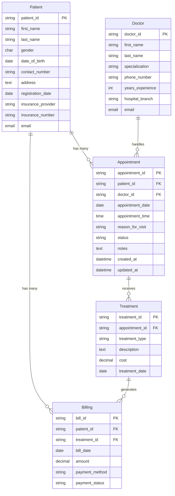
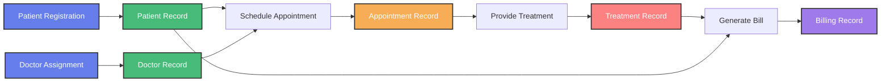
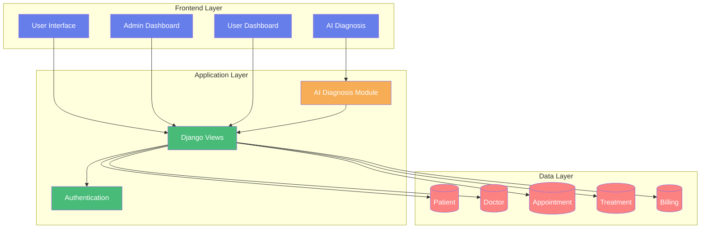
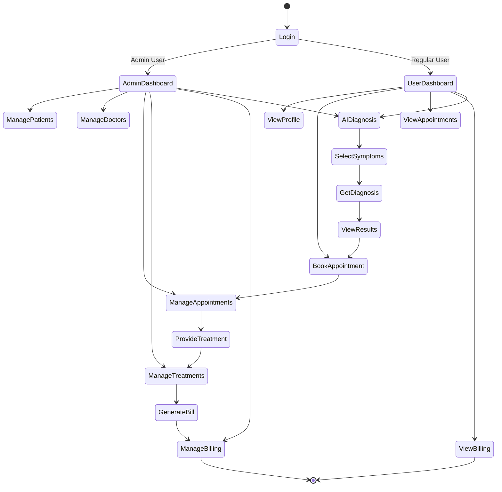
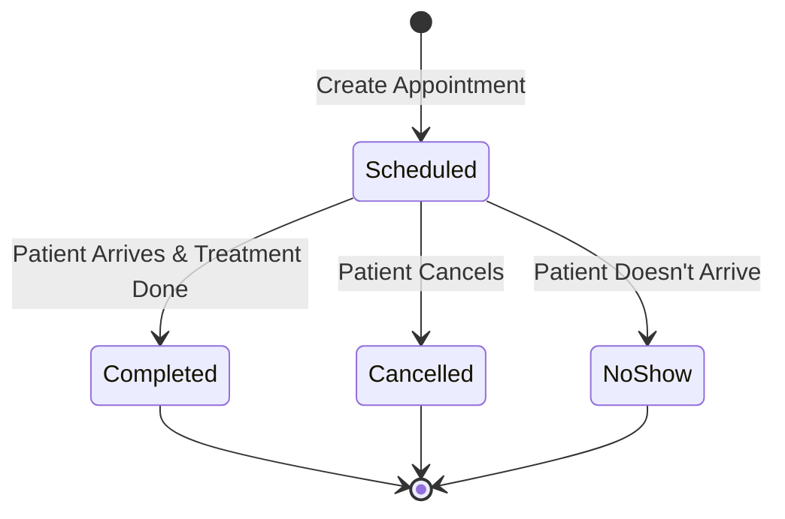
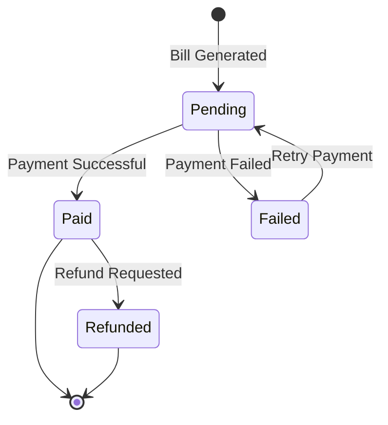

# Medicare Management System - Database Schema

## Entity Relationship Diagram



## Detailed Schema Information

### Patient Entity
- **Primary Key**: `patient_id` (e.g., P001, P002, ...)
- **Gender Choices**: Male (M), Female (F), Other (O)
- **Computed Properties**:
  - `full_name`: Combines first_name and last_name
  - `age`: Calculates age from date_of_birth
- **Relationships**:
  - One-to-Many with Appointments
  - One-to-Many with Billing

### Doctor Entity
- **Primary Key**: `doctor_id` (e.g., D001, D002, ...)
- **Specializations**: Cardiology, Dermatology, Pediatrics, Oncology, Neurology, Orthopedics, Other
- **Computed Properties**:
  - `full_name`: Combines "Dr." + first_name + last_name
- **Relationships**:
  - One-to-Many with Appointments

### Appointment Entity
- **Primary Key**: `appointment_id` (e.g., A001, A002, ...)
- **Status Choices**: Scheduled, Completed, Cancelled, No-show
- **Reason Choices**: Checkup, Consultation, Follow-up, Emergency, Therapy
- **Foreign Keys**:
  - `patient_id` → Patient
  - `doctor_id` → Doctor
- **Relationships**:
  - Many-to-One with Patient
  - Many-to-One with Doctor
  - One-to-Many with Treatment
- **Ordering**: Latest appointments first (DESC by date and time)

### Treatment Entity
- **Primary Key**: `treatment_id` (e.g., T001, T002, ...)
- **Treatment Types**: X-Ray, MRI, ECG, Chemotherapy, Physiotherapy, Surgery, Laboratory
- **Foreign Keys**:
  - `appointment_id` → Appointment
- **Relationships**:
  - Many-to-One with Appointment
  - One-to-Many with Billing
- **Ordering**: Latest treatments first (DESC by treatment_date)

### Billing Entity
- **Primary Key**: `bill_id` (e.g., B001, B002, ...)
- **Payment Methods**: Cash, Credit Card, Debit Card, Insurance, Online
- **Payment Status**: Pending, Paid, Failed, Refunded
- **Foreign Keys**:
  - `patient_id` → Patient
  - `treatment_id` → Treatment
- **Relationships**:
  - Many-to-One with Patient
  - Many-to-One with Treatment
- **Ordering**: Latest bills first (DESC by bill_date)

## Data Flow Diagram



## System Architecture



## User Journey Flow



## Appointment Lifecycle



## Billing Payment Flow



## Database Statistics (Current Data)

- **Patients**: 50 records
- **Doctors**: 10 records
- **Appointments**: 200 records
- **Treatments**: 200 records
- **Billing**: 200 records

**Total Records**: 660

## Key Features

1. **Primary Keys**: All custom string-based IDs (P001, D001, A001, T001, B001)
2. **Cascade Deletion**: Deleting a parent record removes related records
3. **Choices/Enums**: Predefined options for gender, specializations, status, etc.
4. **Auto Timestamps**: Created_at and updated_at for appointments
5. **Computed Properties**: full_name and age calculated dynamically
6. **Ordering**: All models ordered by date/ID (latest first)
7. **Related Names**: Reverse relationship access (e.g., patient.appointments.all())

## Usage Examples

### Get all appointments for a patient
```python
patient = Patient.objects.get(patient_id='P001')
appointments = patient.appointments.all()
```

### Get all treatments from an appointment
```python
appointment = Appointment.objects.get(appointment_id='A001')
treatments = appointment.treatments.all()
```

### Get patient's total billing
```python
patient = Patient.objects.get(patient_id='P001')
total = sum(bill.amount for bill in patient.bills.all())
```

### Get doctor's completed appointments
```python
doctor = Doctor.objects.get(doctor_id='D001')
completed = doctor.appointments.filter(status='Completed')
```
